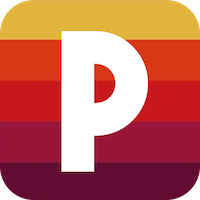

# Phosphor



Phosphor is a retro video player for macOS and Windows that emulates the look and feel of CRT TVs, old VHS tapes, and classic scanlines. Designed for enthusiasts and developers who love vintage video effects.

> **Prerequisites:** Phosphor requires [MPV](https://mpv.io/) to be installed on your system.  
> - **macOS:** Install MPV via Homebrew (`brew install mpv`). The necessary libraries are automatically found by Phosphor.  
> - **Windows:** You need `libmpv-2.dll` (MPV executable is not required). A reliable source is [SourceForge MPV Windows builds](https://sourceforge.net/projects/mpv-player-windows/files/libmpv/). Ensure the folder containing `libmpv-2.dll` is in your system `PATH`.

## Quick Start

You can get Phosphor running in two ways:

1. **Use a pre-built binary (recommended)**  
   Download the binary for your system from the [Releases page](https://github.com/mikegasche/Phosphor/releases) and run it directly – no Python setup needed. This is the easiest way to start.

2. **Run with Python (for development or advanced users)**  
   If you want to develop Phosphor or run it from source, follow these steps:

   **macOS / Linux:**

   ```bash
   ./bin/setup.sh
   ./bin/phosphor.sh
   ```

   **Windows:**

   ```powershell
   bin\setup.bat
   bin\phosphor.bat
   ```

   This will create a virtual environment, install the required packages (PySide6, PyInstaller, python-mpv), and run the app.

## Features

- Play video files (`.mp4`, `.mkv`, `.avi`, `.mov`) with a retro look.
- Adjustable shader effects:
  - **CRT Frame** – simulates old cathode-ray displays.
  - **Scanlines** – classic horizontal lines for retro visuals.
  - **VHS Noise** – adds VHS-style distortion and flicker.
- Single slider per shader to control effect strength (-5 to +5).
- Built-in presets: `Clean`, `80s TV`, `VHS (later)`.
- Custom preset support based on your slider settings.
- Optional **Retro Audio** filter for an authentic audio experience.
- Integrated On-Screen Controller (OSC) for mouse-based playback control.
- Mouse interactions (scroll, click, right-click) are fully supported.
- Cross-architecture macOS support (Intel & Apple Silicon).
- Persisted settings for last used directory, effect toggles, and slider values.

## Shaders

- **CRT Shader** – `shaders/crt_base_[−5..5].glsl`
- **Scanline Shader** – `shaders/scanlines_[−5..5].glsl`
- **VHS Shader** – `shaders/vhs_noise_[−5..5].glsl`
- Shaders are applied based on slider values. Negative and positive values select different pre-defined stages.

## Controls

- **Left-click** – Play / Pause (via OSC)  
- **Scroll wheel** – Seek or volume control depending on OSC mode  
- **Right-click** – Open OSC context menu  
- **Sliders & checkboxes** – Adjust shader strength and enable/disable effects  
- **Preset dropdown** – Quickly switch between predefined visual effects  

## Installation

1. Clone the repository:

   ```bash
   git clone https://github.com/mikegasche/phosphor.git
   cd phosphor
   ```

2. Set up Python environment:

   ```bash
   ./bin/setup.sh
   ```

   or

   ```powershell
   bin\setup.bat
   ```

3. Run the app:

   ```bash
   ./bin/phosphor.sh
   ```

   or

   ```powershell
   bin\phosphor.bat
   ```

## Building App Bundle

   ```bash
   ./bin/make.sh
   ```

   or

   ```powershell
   bin\make.bat
   ```

## License

This project is licensed under the **MIT License**. See the LICENSE file for details.
